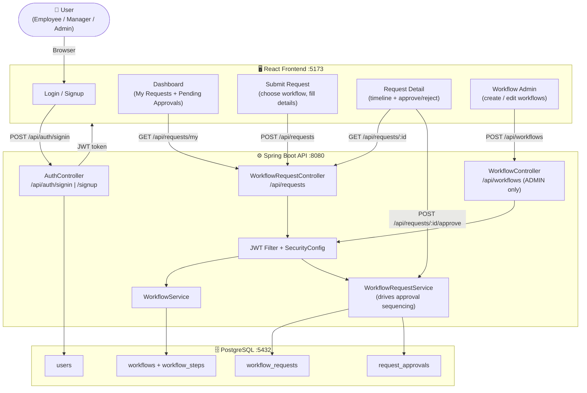

# AuraFlow — Enterprise Workflow Automation System

> A full-stack, enterprise-grade **Approval & Workflow Engine** that replaces rigid, hard-coded approval chains with dynamic, admin-configurable multi-step workflows — think mini ServiceNow or Jira Approval Engine, built from scratch.

[](https://openjdk.org/projects/jdk/17/)
[](https://spring.io/projects/spring-boot)
[](https://react.dev/)
[](https://www.postgresql.org/)
[](https://www.typescriptlang.org/)

---

## 📂 Project Structure

```
workflow-system/
├── backend/                              # Spring Boot Application
│   ├── src/
│   │   └── main/
│   │       ├── java/com/workflow/
│   │       │   ├── config/               # DataSeeder (seeds default users on startup)
│   │       │   ├── controller/           # AuthController, WorkflowController, WorkflowRequestController
│   │       │   ├── dto/                  # Request/Response DTOs
│   │       │   ├── exception/            # GlobalExceptionHandler, ResourceNotFoundException
│   │       │   ├── mapper/               # MapStruct mappers (WorkflowMapper, WorkflowRequestMapper)
│   │       │   ├── model/                # JPA Entities (User, Workflow, WorkflowStep, WorkflowRequest, RequestApproval)
│   │       │   ├── repository/           # Spring Data JPA repositories
│   │       │   ├── security/             # JWT filter, SecurityConfig, UserDetailsServiceImpl
│   │       │   └── service/              # WorkflowService, WorkflowRequestService
│   │       └── resources/
│   │           └── application.properties
│   └── pom.xml
│
└── frontend/                             # React + Vite Application
    ├── src/
    │   ├── components/                   # Navbar
    │   ├── context/                      # AuthContext (JWT state management)
    │   ├── pages/                        # Login, Signup, Dashboard, WorkflowAdmin,
    │   │                                 #   SubmitRequest, RequestDetails
    │   ├── services/                     # Axios instance (pre-configured with JWT interceptors)
    │   ├── types/                        # TypeScript interfaces
    │   └── App.tsx                       # Router with protected routes
    └── package.json
```

---

## 🏗️ Architecture & Request Flow

### High-Level Flow



---

### 🔢 Request Lifecycle — Step by Step

| Step | Component | Action | Result |
|------|-----------|--------|--------|
| **1** | `AuthController` | User signs in with email + password | JWT issued with role claim (`EMPLOYEE`, `MANAGER`, `ADMIN`) |
| **2** | `JWT Filter` | Every subsequent request validates the Bearer token | Unauthorized → **401** |
| **3** | `WorkflowController` | Admin creates a workflow with N ordered steps (each assigned to a role or user) | Workflow persisted in PostgreSQL |
| **4** | `WorkflowRequestController` | Employee selects a workflow and submits a request with a description | `WorkflowRequest` created with status `PENDING` |
| **5** | `WorkflowRequestService` | Service identifies the **current active step** (lowest order step not yet decided) | Surfaces the correct approver |
| **6** | Approver (Manager/Admin) | Approver navigates to Request Detail and clicks **Approve** or **Reject** with a comment | `RequestApproval` record written |
| **7** | `WorkflowRequestService` | All steps approved → request moves to `APPROVED`; any rejection → `REJECTED` | Final status persisted |
| **8** | `Dashboard` | All users see live status of their requests; Admins/Managers see all pending requests | React polls on mount |

---

## 🧪 Demo — See It In Action

Once both services are running, open **http://localhost:5173**

### Default Seeded Accounts

| Role | Email | Password |
|------|-------|----------|
| `ADMIN` | `admin@workflow.com` | `admin123` |
| `MANAGER` | `manager@workflow.com` | `manager123` |

### 1. Create a Workflow (Admin)
1. Log in as `admin@workflow.com`
2. Navigate to **Workflow Admin** → **Create New Workflow**
3. Add a name (e.g. *"Leave Approval"*) and define steps in order:
   - Step 1 → `MANAGER` role
   - Step 2 → `ADMIN` role
4. Save — the workflow is immediately available for submissions.

### 2. Submit a Request (Employee)
```
1. Sign up as a new user (default role: EMPLOYEE)
2. Click "Create Request" on the Dashboard
3. Select "Leave Approval" workflow
4. Fill in the description and submit
```
**What you'll see:** Request appears in your Dashboard with status **PENDING**.

### 3. Approve Through Each Step (Manager → Admin)
```
1. Log in as manager@workflow.com → Request appears in "All Organizational Requests"
2. Open the request → Click "Approve" on Step 1
3. Log in as admin@workflow.com → Open the request → Approve Step 2
4. Status changes to APPROVED — visible to all parties instantly
```

---

## 🔄 Component Roles

| Component | Tech | Role |
|-----------|------|------|
| **AuthController** | Spring Security + JJWT 0.12.5 | Handles sign-in and sign-up; issues signed JWT tokens with role claims |
| **WorkflowController** | Spring MVC REST | CRUD for Workflows and their ordered steps (Admin-only) |
| **WorkflowRequestController** | Spring MVC REST | Submit requests, retrieve request lists, trigger approval actions |
| **WorkflowRequestService** | Spring Service + JPA | Core business logic — drives sequential approval, computes active step, finalises status |
| **PostgreSQL** | Relational DB | Persists all entities with JPA-managed schema via `spring.jpa.hibernate.ddl-auto=update` |
| **MapStruct** | Code-gen mapper | Converts JPA entities ↔ DTOs at compile time with zero runtime reflection overhead |
| **React + Vite** | Frontend framework | SPA with protected routes, JWT storage, and real-time status reflection |
| **AuthContext** | React Context API | Global auth state — stores JWT and user role, auto-attaches token to every Axios request |

---

## 🧠 How the Intelligence Works

### Sequential Approval Engine

```
Workflow: "IT Hardware Request"
  ├── Step 1 (order=1) → assigned to MANAGER role
  ├── Step 2 (order=2) → assigned to ADMIN role
  └── Step 3 (order=3) → assigned to ADMIN role

Request submitted by Employee:
  → Service finds MIN(order) where status == PENDING   → Step 1 activated
  → Manager approves Step 1                           → Step 2 activated
  → Admin approves Step 2                             → Step 3 activated
  → Admin approves Step 3                             → Request = APPROVED
  → ANY step REJECTED                                 → Request = REJECTED immediately
```

### Role-Based Access Control (RBAC)

| Action | `EMPLOYEE` | `MANAGER` | `ADMIN` |
|--------|-----------|----------|--------|
| Submit a request | ✅ | ✅ | ✅ |
| View own requests | ✅ | ✅ | ✅ |
| View all requests | ❌ | ✅ | ✅ |
| Approve / Reject steps | ❌ | ✅ | ✅ |
| Create / Edit Workflows | ❌ | ❌ | ✅ |

---

## 🌍 Real-World Use Cases

### 🏢 IT Asset Procurement
An employee requests a new laptop. The request flows through a **Manager** for budget sign-off, then an **IT Admin** for provisioning approval — all tracked with timestamped comments.

### 🏖️ Leave Management
HR configures a *"Leave Request"* workflow with the employee's direct manager as Step 1 and HR Admin as Step 2. The entire chain is auditable, with every decision and comment permanently stored.

### 💼 SaaS Vendor Onboarding
A company uses AuraFlow to enforce a multi-department review (Finance → Legal → CTO) before a new SaaS tool is approved for use. The workflow is created once in the Admin panel and reused for every new vendor request.

---

## 🚀 Getting Started

### Prerequisites
- **Java 17+**
- **Maven 3.8+** (or use the included Maven Wrapper `./mvnw`)
- **Node.js 18+**
- **PostgreSQL** running locally on port **5432**

### 1. Prepare the Database
```sql
CREATE DATABASE workflow_db;
```
> Default connection: `host=localhost`, `user=postgres`, `password=postgres`
> Change these in `backend/src/main/resources/application.properties` if needed.

### 2. Start the Backend
```bash
cd backend
./mvnw clean spring-boot:run
```
Or on Windows:
```powershell
cd backend
.\mvnw.cmd clean spring-boot:run
```
> On first boot, `DataSeeder` automatically creates the `admin@workflow.com` and `manager@workflow.com` accounts.

### 3. Start the Frontend
```bash
cd frontend
npm install
npm run dev
```

| Service | URL |
|---------|-----|
| React Frontend | http://localhost:5173 |
| Spring Boot API | http://localhost:8080 |
| Swagger UI | http://localhost:8080/swagger-ui/index.html |

---

## 💡 Why This Project Stands Out

| Skill | Demonstrated By |
|-------|----------------|
| **Domain-Driven Design** | Clean separation of `model`, `dto`, `service`, `repository`, and `controller` layers |
| **Type-Safe Mapping** | MapStruct generates DTO mappers at compile time — zero boilerplate, zero runtime risk |
| **Stateless Auth** | JWT-based authentication — no sessions, fully scalable horizontally |
| **Dynamic Business Logic** | Workflows are runtime-configurable; no code change needed to add or reorder approval steps |
| **Reactive UI** | React with Context API and Axios interceptors — auth state flows transparently through the entire app |
| **RBAC** | Spring Security method-level and URL-level role guards enforce least-privilege access |

